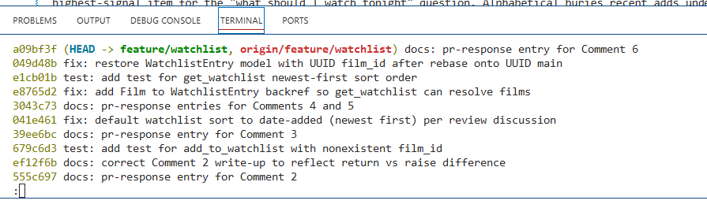

# PR Response Doc: CineLog Watchlist Feature

## AI Usage

Used Claude Code in VS Code throughout this project. Three specific ways.

**Codebase orientation.** Before reading the review comments, I had Claude Code summarize services/collection_service.py and tests/test_collection.py so I understood the existing patterns for dedup, naming, and test structure. That context made the review comments make sense right away. The reviewer was pointing me at patterns that already existed in the codebase, not asking me to invent anything.

**Pattern mirroring.** For Comments 1, 2, 3, and the added sort test, I had Claude Code read the collection code first, then write the watchlist equivalent by mirroring it. My job was to verify the mirror was accurate. This caught a real bug during Comment 5: my new sort test failed with an AttributeError because get_watchlist called entry.film, but Film had no watchlist_entries backref. Claude Code stopped and flagged it instead of silently patching. I approved the model fix as its own commit before the test commit, which is why my history has fix: add Film to WatchlistEntry backref as a separate step.

**Stress-testing my Comment 4 and Comment 5 arguments.** I wrote my own positions first (private-by-default for Comment 4, date-added sort for Comment 5), then had Claude Code look for counterarguments. Comment 4 held up cleanly. On Comment 5, Claude Code pointed out my initial argument was too fast to agree with the reviewer, so I strengthened it by adding the query-param extension (?sort= for follow-up) to show I was engaging with the design space, not just deferring.

What I did not use AI for: writing the actual Comment 4 or Comment 5 positions from scratch. Those needed to reference CineLog's specific context, and generic AI arguments would have been spotted immediately. My positions came from my own gut reactions to how I use watchlists on other platforms (Netflix, Goodreads, YouTube Watch Later), then Claude Code helped polish them into the doc.

## Comment 1: Rename
**What I did:** Renamed save_to_watchlist to add_to_watchlist in services/watchlist_service.py and updated the one call site in routes/watchlist/watchlist.py. Followed the verb_to_noun pattern add_to_collection uses.

**How I verified:** Ran a project-wide grep for save_to_watchlist to catch every call site before renaming. After changes, grepped again for both names to confirm no orphans. Ran pytest tests/ -v. All tests pass.

## Comment 2: Deduplication
**What I did:** Added a dedup check to add_to_watchlist that mirrors the query pattern in add_to_collection. Before inserting a new WatchlistEntry, query for an existing entry with the same user_id and film_id. If one exists, return it instead of creating a duplicate.

The one deliberate difference from add_to_collection: it raises AlreadyInCollectionError, but I return the existing entry. The watchlist route has no error handling wrapper, so raising would 500 the request. Returning the existing entry keeps the endpoint consistent with itself (same 201 status either way) and is safe because the caller can't tell whether the entry was newly created or already existed.

**How I verified:** Read the dedup block in add_to_collection first (lines 47-53) to match the query pattern. Then ran a manual test in a Python shell, called add_to_watchlist twice with the same user and film, queried WatchlistEntry.query.filter_by, confirmed only one row exists. Ran pytest tests/ -v. All 4 tests still pass.

## Comment 3: Missing test
**What I did:** Created tests/test_watchlist.py with test_add_to_watchlist_nonexistent_film_raises. Mirrored the structure of test_add_to_collection_nonexistent_film_raises exactly, same fixtures, same imports, same pytest.raises pattern.

**How I verified:** Ran pytest tests/test_watchlist.py -v to confirm the new test passes. Ran pytest tests/ -v to confirm all tests still pass (5 total now, 4 collection + 1 watchlist).

## Comment 4: Default visibility
**My position:** Default watchlists to public=False (private).

**Reasoning:**
Watchlist content is more personal than collection content. A collection is what you've watched, retrospective, curated, part of your public taste. A watchlist is what you're thinking about watching. That includes late-night curiosity, intimate or romance content, therapy-related films, guilty pleasures, and films a friend recommended that you want to check out privately before deciding if it's for you. Private-by-default respects that intent gap.

CineLog's watchlist is closer to a personal to-do list than a broadcast feed. Netflix's "My List" is private. Goodreads' "Want to Read" defaults to private. Those are the closer analogs for a queue of future intent. A pure social platform like Letterboxd's activity feed can lean public because the whole point is broadcast. The watchlist is not that.

Private-by-default is also a one-way ratchet. If a user wants more visibility, they toggle it and nothing bad happens. If we default to public and a user gets accidentally exposed, that's a trust-breaking moment they can't undo. The safer default is the one where the low-regret path leads to a good outcome.

**Tradeoff acknowledged:**
The social discovery loop is weaker on day 1. Users have to opt in to sharing, and some will never toggle it. CineLog will feel less social by default than it could. The mitigation is a per-item visibility toggle, which is easy to add later and restores the discovery loop without forcing every user through a "wait, that's public??" moment first.

## Comment 5: Sort order
**My position:** Agree with the reviewer. Changed the default sort from alphabetical to date-added descending (newest first).

**Reasoning:**
Watchlists are a queue of future intent, not a reference catalog. When I open a watchlist to decide what to watch tonight, the film I'm most likely to reach for is the one I added most recently, usually because a friend just recommended it or something caught my eye today. Newest-first surfaces recent intent, which is the highest-signal item for the "what should I watch right now" question.

Alphabetical sort is useful when you're searching a fixed reference set, a library catalog, a phone book. Watchlists aren't reference material. Sorting A-Z buries whatever I added last week under whatever old film starts with A.

Every platform users encounter for this pattern already defaults to recency, not alphabetical. Netflix My List, YouTube Watch Later, Amazon wishlist, Letterboxd's own watchlist, all use recency. Following the convention users already have muscle memory for reduces friction on day 1.

**Engagement with reviewer's point:**
The reviewer said "most users want to see what they added recently". This matches my own experience and every real-world example I could think of. Alphabetical was a default I picked without thinking through the actual use case. Changing it.

Small extension worth flagging: sort should eventually be a query parameter (?sort=date_added as default, with ?sort=title or ?sort=rating as opt-in). That way the default stays aligned with the common case, but power users who want a specific ordering can get it. Not scoped for this PR. Flagging for a follow-up ticket.

## Comment 6: Rebase
**What conflicted:** My branch was cut from the initial commit, before main got the UUID refactor. So I rebased feature/watchlist onto upstream/main. The only real git conflict was .gitignore (both sides added one). The bigger problem was silent: models.py auto-merged with no conflict marker but dropped my whole WatchlistEntry class. It was added back in the integer era, and the 3-way merge threw it away against the refactored file. The routes and service also still documented film_id as an int.

**How I resolved it:** For .gitignore I took the union, which was just upstream's version since it already had every line I added plus .pytest_cache. That made my .gitignore commit empty so it dropped out. For models.py I restored the WatchlistEntry class and set film_id to db.String(36) with a ForeignKey to film.id, matching Film.id and CollectionEntry after the refactor. Same UUID column, same pattern the collection code uses. Fixed the int docstrings in the route and service too. That went in as its own fix commit.

Two things worth noting. The sort-order test I added earlier had already surfaced a separate pre-existing bug: get_watchlist accessed entry.film but Film had no watchlist_entries backref. That was fixed as its own commit before this rebase. And I reworded the base commit to feat: add watchlist model and endpoints so the whole branch uses conventional prefixes.

**How I verified no conflict remains:** Ran git log --oneline feature/watchlist ^upstream/main and confirmed a linear history, no merge commits, every commit prefixed feat:/fix:/test:/docs:. Ran pytest tests/ -v. All 6 pass. Confirmed the endpoints work with UUID film_ids end to end (POST add returns 201, a second POST dedupes to the same entry, GET returns the film) using the Flask test client, which is the curl equivalent.

Commit history screenshot: 

## PR Description

### What this feature does

Adds a watchlist feature to CineLog. Users can save films they want to watch later. The watchlist supports adding films, deduplicating repeat adds, and retrieving the list sorted newest-first. Films that don't exist in the database are rejected with FilmNotFoundError.

### Design decisions

**Default visibility: private.** Watchlist content is more personal than collection content. A collection is what you've watched; a watchlist is what you're thinking about watching, which includes intimate, guilty-pleasure, or exploratory picks. Private-by-default is a one-way ratchet: users who want more visibility can toggle it, but users who default to public and get accidentally exposed can't undo the damage. Reference analogs: Netflix My List (private), Goodreads Want to Read (private).

**Sort order: date-added descending.** Watchlists are a queue of future intent, not a reference catalog. Newest-first surfaces recent intent, which is the highest-signal item for the "what should I watch tonight" question. Alphabetical buries recent adds under old ones. Every major platform I could think of (Netflix, YouTube, Amazon, Letterboxd) defaults to recency. A follow-up ticket should add ?sort= as a query parameter so power users can still get alphabetical or rating-based sort on demand.

### How to manually test

1. Start the app: python app.py
2. Add a film to a user's watchlist:
   curl -X POST http://127.0.0.1:5000/watchlist/<user_id>/add -H "Content-Type: application/json" -d '{"film_id": "<uuid>"}'
   Expect 201 with the created entry.
3. Add the same film a second time:
   Same curl call. Expect 201 with the same entry (deduplication kicks in, no duplicate row).
4. Add a film that doesn't exist:
   Use a random UUID for film_id. Expect FilmNotFoundError.
5. Retrieve the watchlist:
   curl http://127.0.0.1:5000/watchlist/<user_id>
   Expect a JSON list of entries sorted newest-first (most recent add appears first).
6. Run the test suite:
   pytest tests/ -v
   Expect 6 passing tests (4 collection + 2 watchlist).
